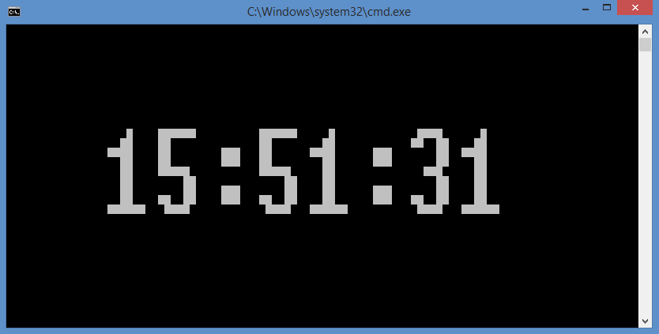

# BigCharClock
A clock that uses big font!


### About

This is a python script that can be used to display the current time through a terminal on a computer. It will display the time with large block font that is centered making it not only easier but also intresting to read. It was a nice way to show off the capabilities of my GlyphManager module.

### Pictures

### Usage

In the current state it will run if you execute 
```
python BigCharClock.py
```
There are 2 functions. The first is a plain clock and the second one is the same although padding has been added to center it.

### Dependencies

Depends on my GlyphManager module found at https://github.com/bobxychen/GlyphManager (shameless)
